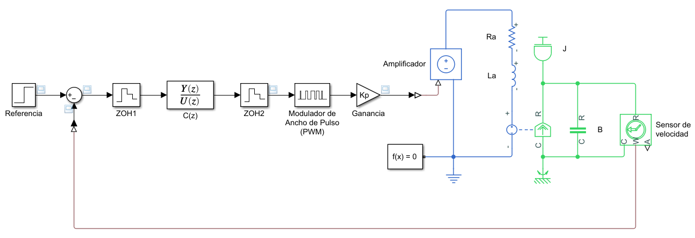
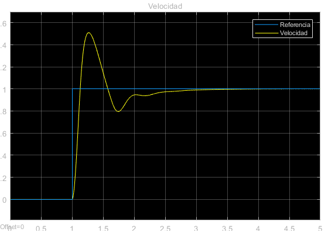

---
title:  Control discreto de velocidad en lazo cerrado para un motor de CD
author: Gastón Hugo Salazar Silva
layout: post
...

## Introducción

A continuación, aplicaremos el control discreto a un sistema de control de
velocidad en lazo cerrado para un motor de CD. 

Primeramente, analizaremos una implementación en Simulink del sistema de control
discreto. Veremos algunas diferencias con el esquema de control en el dominio
continuo.

Después pasaremos al diseño del sistema de control discreto. Para ello, primero
obtendremos la función de transferencia de la planta en el dominio continuo.
Luego, diseñaremos el sistema de control en el dominio continuo. Finalmente,
obtendremos el sistema de control en el dominio discreto a partir del continuo.

De ahí, veremos el resultado del sistema de control y pasaremos a las
conclusiones.

## Sistema de control discreto

Partiremos del [Control de velocidad en lazo cerrado para un motor de CD en el
dominio continuo](docs/control-velocidad-lazo-cerrado-motor-cd.md) que
implementamos anteriormente.

||
|---|
|Figura 1: Control discreto de velocidad en lazo cerrado para un motor de CD.|

En la figura 1, podemos apreciar el sistema de control discreto de velocidad en
lazo cerrado para un motor de CD. A diferencia del sistema continuo,
utilizaremos como controlador una función de transferencia discreta, $C_d(z)$.

**Errata**: En la figura 1, $C_d(z)$ aparece como $C(z)$.

Como esta función de transferencia no puede operar directamente en el sistema
continuo, necesitamos una interfaz entre el sistema continuo y el control
discreto. Esa interfaz está compuesta por dos [retenedores de orden
cero](https://en.wikipedia.org/wiki/Zero-order_hold), $ZOH_1$ y $ZOH_2$.

En Simulink no es necesario cuantificar la señal de entrada y por lo tanto no
requerimos un [convertidor
analógico--digital](https://es.wikipedia.org/wiki/Conversor_de_se%C3%B1al_anal%C3%B3gica_a_digital);
sin embargo sí en necesario muestrear la señal y para eso sirve el $ZOH_1$.

En cuanto al controlador PID, este se dividió en dos etapas para su
implementación: en la función de transferencia discreta $C_d(z)$ y la ganancia
continua $K_p$. La función de transferencia $C_d(z)$ se obtiene de la ecuación

$$u = e + \frac{K_i}{K_p} \int_0^t e(\tau) d\tau + \frac{K_d}{K_p}
\frac{de}{dt}. \tag{1}$$

La ecuación (1) es básicamente el controlador PID con la ganancia $K_p$
factorizada. La ganancia $K_p$ aparece junto al amplificador. Si multiplicamos
la función de transferencia $C_d(z)$ con $K_p$, entonces obtenemos la función de
transferencia del PID.

Hacemos esta factorización del PID para evitar el sobreflujo aritmético. Hay que
recordar que la precisión en la aritmética de una computadora está limitada por
el número de bits del tipo de número. Una ganancia $K_p$ muy alta puede causar
este error de sobreflujo aritmético. Por ello, lo ideal sería que $C_d(z)$
tuviera una ganancia de estado estacionario de 1. Si se requiere una ganancia de
estado estacionario mayor, esto recae en la etapa analógica como un
amplificador. En ocasiones, también se pone un amplificador también en la entada
si la señal es muy pequeña.

Saliendo de $C_d(z)$ tenemos a $ZOH_2$, cuya función es la interfaz entre la
parte discreta y la continua. Luego pasamos al modulador de ancho de pulso (PWM,
por sus siglas en inglés).

En la práctica, no se utilizan amplificadores lineales en un sistema de control
sino amplificadores conmutados como, por ejemplo, un *medio* [puente
H](https://en.wikipedia.org/wiki/H-bridge). Por ello, requerimos el PWM. Otra
razón más para factorizar el PID es que no saturamos el PWM.

### Modelo de la planta

Para modelar el motor, utilizamos nuevamente los parámetros publicados en [DC
Motor Speed: System
Modeling](https://ctms.engin.umich.edu/CTMS/index.php?example=MotorSpeed&section=SystemModeling),
y que se muestran a continuación en código Matlab.

~~~
J = 0.01;
b = 0.1;
K = 0.01;
R = 1;
L = 0.5;
~~~

## Diseño del sistema de control

Anteriormente explicamos que Simulink dispone en la librería componentes para
implementar PID; sin embargo decidimos utilizar una función de transferencia
discreta para la implementación.

Como se explicó en [Procedimiento de
discretización](../docs/procedimiento-discretizacion.md), hay dos caminos para
obtener un sistema de control discreto. El camino que vamos a seguir es:

1. Obtener la función de transferencia de la planta en el dominio continuo.
2. Diseñar el sistema de control en el dominio continuo.
3. Obtener el sistema de control en el dominio discreto a partir del continuo.

### Función de transferencia de la planta en el dominio continuo

Para obtener la función de transferencia de la planta en el dominio continuo,
utilizaremos Matlab. El código se mostrará por pasos.

Primeramente, definiremos la variable $s$, como se muestra a continuación

~~~
s = tf('s');
~~~

El modelo del motor está dado por la función de transferencia

$$M(s) = \frac{K}{(J*s+b)*(L*s+R)+K^2} \tag{2}$$

lo cual transcribimos como la siguiente expresión de Matlab.

~~~
M = K / ((J*s+b)*(L*s+R)+K^2);
~~~

La función de transferencia que obtenemos es

$$M(s) = \frac{0.01}{0.005 s^2 + 0.06 s + 0.1001}.$$

Si deseamos una [expresión
mónica](https://en.wikipedia.org/wiki/Monic_polynomial), ésta la obtenemos por
medio de la siguiente expresión de Matlab.

~~~
M = minreal(M);
~~~

La función de transferencia resultante es 

$$M(s) = \frac{2}{s^2 + 12 s + 20.02}. \tag{3}$$

### Sistema de control en el dominio continuo

Por cuestión de implementación, utilizaremos nuevamente el control [PID de banda
limitada](../docs/control-velocidad-lazo-cerrado-motor-cd.html). Sin embargo,
como ya mencionamos, factorizaremos $K_p$. La función de transferencia resultante
es

$$C(s) = 1+ \frac{K_i}{K_p}\frac{1}{s} + \frac{K_d}{K_p} \frac{Ns}{s+N} \tag{4}$$

Nuevamente, utilizaremos los mismos coeficientes del
controlador PID que aparecen en la publicación [DC Motor Speed: System
Modeling](https://ctms.engin.umich.edu/CTMS/index.php?example=MotorSpeed&section=SystemModeling),
y que se muestran a continuación en código Matlab.

~~~
Kp = 100;
Ki = 200;
Kd = 10;
N = 100;
~~~

Para obtener el PID utilizaremos la función
[`pid`](https://www.mathworks.com/help/control/ug/proportional-integral-derivative-pid-controllers.html)
de Matlab, la cual convertiremos a una función de transferencia mónica. Esto se
muestra en la siguiente expresión de Matlab.

~~~
C = minreal(tf(pid(1,Ki/Kp,Kd/Kd, N)));
~~~

La función de transferencia que obtenemos aparece a continuación

$$C(s) = \frac{1.01 s^2 + 2.01 s + 0.02}{s^2 + 0.01 s}. \tag{5}$$

## Sistema de control en el dominio discreto

Para obtener el sistema discreto, primero debemos determinar la frecuencia de
muestreo requerida. Para ello, primero obtenemos la función de transferencia en
lazo cerrado, por medio de la función
[`feedback`](https://www.mathworks.com/help/control/ug/using-feedback-to-close-feedback-loops.html)
de Matlab.

~~~ 
G = minreal(feedback(C*Kp*M,1));
~~~

Nótese que aquí ya incorporamos la ganancia proporcional $K_p$ en el producto
del lazo cerrado.

La función de transferencia obtenida eso

$$G(s) = \frac{202 s + 400}{s^3 + 12 s^2 + 222 s + 400} \tag{6}.$$

Luego calculamos el ancho de banda en Hertz, utilizando la función
[`bandwidth`](https://www.mathworks.com/help/control/ref/lti.bandwidth.html) de
Matlab. El resultado está en radianes sobre segundo, por lo que hay que
convertirlo a Hertz. 

~~~
Bw = bandwidth(G)/2/pi;
~~~

El ancho de banda resultante es de 3.2 Hz.

Por el [teorema de muestreo de
Nyquist-Shannon](https://es.wikipedia.org/wiki/Teorema_de_muestreo_de_Nyquist-Shannon),
la frecuencia de muestreo debe ser superior al doble del ancho de banda del
sistema. Seleccionamos un valor de 10,

~~~
fs = 10*Bw;
~~~

Por lo tanto, la frecuencia de muestro es de 32 Hz. El periodo de muestreo está
dada por el inverso:

~~~
h = 1/fs;
~~~

Con lo que obtenemos que el periodo de muestreo es de

$$h =  0.0313 \;\mathrm{s}.$$

Finalmente, discretizamos la función de transferencia (5). Para ello, utilizamos
la función de Matlab
[`c2d`](https://www.mathworks.com/help/control/ref/lti.c2d.html), tal como se
muestra continuación.

~~~
Cd = c2d(C,h, 'Tustin');
~~~

Como resultado obtenemos el controlador discreto

$$C_d(s) = \frac{1.041 z^2 - 2.02 z + 0.9784}{z^2 - 2 z + 0.9997} \tag{7}$$

## Resultado

El resultado del sistema discretizado se puede ver por medio de la respuesta
escalón, tal como se muestra en la figura 2.

||
|---|
|Figura 2. Respuesta escalón del sistema de control discreto.|

Como podemos ver, la salida regulada alcanza sin problemas a la referencia.

## Conclusiones

En este texto, aplicamos el control discreto a un sistema de control de
velocidad en lazo cerrado para un motor de CD. 

Primeramente, analizamos una implementación en Simulink del sistema de control
discreto. Vimos algunas diferencias con el esquema de control en el dominio
continuo.

Después pasamos al diseño del sistema de control discreto. Para ello, primero
obtuvimos la función de transferencia de la planta en el dominio continuo.
Luego, diseñamos el sistema de control en el dominio continuo. Finalmente,
obtuvimos el sistema de control en el dominio discreto a partir del continuo.

Como resultado, obtuvimos un sistema de control donde la salida regulada alcanza
sin problemas a la referencia.
