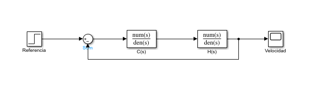
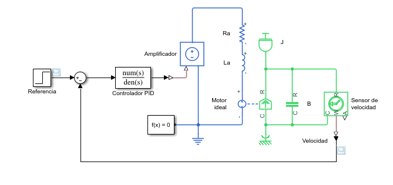
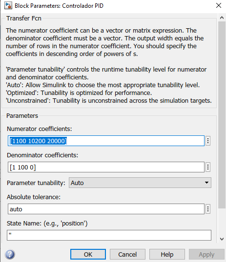
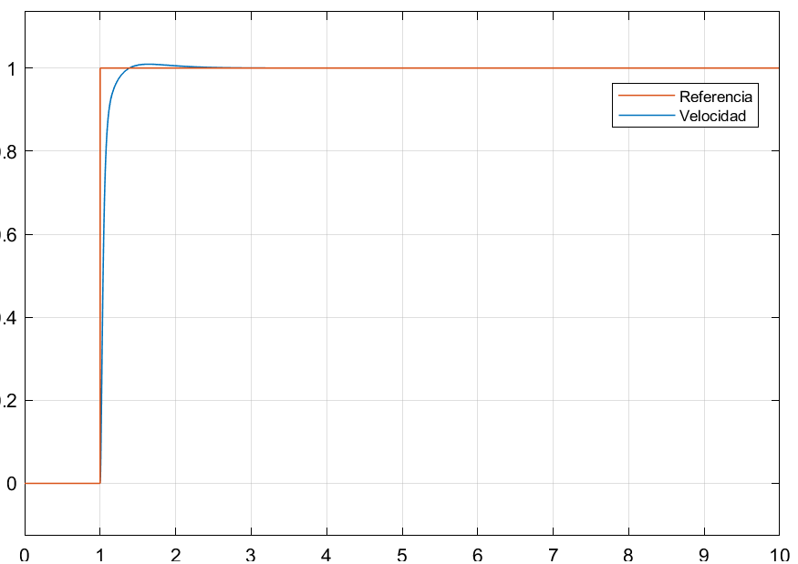
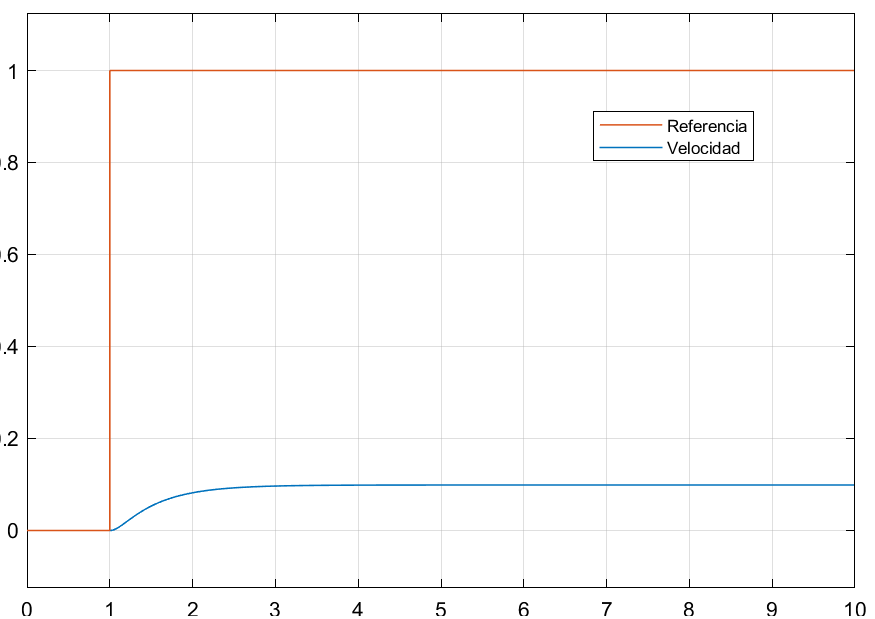

---
title:  Control de velocidad en lazo cerrado para un motor de CD en el dominio continuo
author: Gastón Hugo Salazar Silva
layout: post
...

## Introducción

A continuación, analizaremos un sistema de control de velocidad en lazo cerrado
para un motor de CD, el cual sintonizaremos.

Un sistema de control en lazo cerrado permite mejorar el desempeño de una planta
dada, pero nos introduce un costo económico y en complejidad. Este costo se debe
a que hay que incorporar un sensor y un posiblemente controlador más sofisticado
que en el caso de lazo abierto, así como toda la electrónica para realizar la
interfaz entre componentes.

Otro costo de un sistema en lazo cerrado, es requerimos realizar un análisis más
complejo, ya que el sistema se puede volver inestable.

La figura 1 muestra el sistema de control de velocidad en lazo cerrado para un
motor de CD en el dominio continuo. La función de transferencia $H(s)$
corresponde a la planta, que en este caso es el motor de CD. Por otro lado, la
función de transferencia $C(s)$ es el controlador.

||
|------------------------------------------------------------|
|Figura 1: Diagrama de bloques del sistema de control. La función de transferencia $H(s)$ corresponde al motor de CD, y la función de transferencia $C(s)$ al controlador.|

### Controlador PID de banda limitada

Como se vio anteriormente, un motor de CD con voltaje de campo constante se
puede modelar como un sistema lineal de segundo orden. Un controlador adecuado
para dicha clase de sistema es un **controlador Proporcional-Derivativo** (PD).

Sin embargo, al modelar el sistema se hicieron ciertas suposiciones que no
siempre se cumplen del todo. Por ello conviene utilizar un **controlador
Proporcional-Integral-Derivativo** (PID).

La ley de control del controlador PID se muestra a continuación 

$$u(t) = K_p e(t) + K_i \int_0^t e(\tau) d\tau + K_d \frac{de}{dt} \tag{1}$$

donde $u(t)$ es la señal de control, $K_p$ es la constante proporcional, $K_i$
es la constante integral y $K_d$ es la constante derivativa. En cuanto $e(t)$,
ésta es la señal del error que se define como

$$e(t) = r(t) - y(t) \tag{2}$$

donde $r(t)$ es la señal de referencia y $y(t)$ es la medición de salida de la
planta, en este caso la velocidad angular.

Para implementar el controlador PID en Simulink se utilizará la función de
transferencia de (1), C(s), la cual está dada por la expresión

$$C(s) = K_p + \frac{K_i}{s} + K_d s \tag{3}$$

El principal problema con la función de transferencia (3) es que no es propia, y
por lo tanto se complica su implementación.

Otro problema reside en que el derivador es un filtro pasa-altas con su polo en
el infinito, y por lo tanto amplifica altas frecuencias.

Una forma de resolver ambos problemas es utilizar un **controlador PID de banda
limitada**, que se muestra en la siguiente ecuación

$$C(s) = K_p + \frac{K_i}{s} + K_d \frac{Ns}{s+N} \tag{4}$$

donde la constante $N$ es la frecuencia de corte de un filtro pasa-altas. Esto
reduce de la amplificación de ruido y vuelve propio al sistema. Simplificando la
función de transferencia, obtenemos

$$C(s) = \frac{(K_p+K_d N)s^2 + (K_i + K_p N)s + K_i N}{s^2+Ns} \tag{5}$$

la cual es una función de transferencia propia.

## Implementación en Matlab/Simulink

En la figura 2, podemos ver el modelo de Simscape de un sistema de control de
velocidad en lazo cerrado para un motor de CD en el dominio continuo.

||
|---|
|Figura 2: Modelo de Simscape de un sistema de control de velocidad en lazo cerrado para un motor de CD en el dominio continuo.|

Para modelar el motor, utilizamos nuevamente los parámetros publicados en [DC
Motor Speed: System
Modeling](https://ctms.engin.umich.edu/CTMS/index.php?example=MotorSpeed&section=SystemModeling),
y que se muestran a continuación en código Matlab.

~~~
J = 0.01;
b = 0.1;
K = 0.01;
R = 1;
L = 0.5;
~~~

Si bien, Simulink dispone en la librería componentes para implementar PID,
decidimos utilizar la función de transferencia descrita en la ecuación (5). En
cuanto a los coeficientes del controlador PID, utilizamos los obtenidos para el
mismo motor en la publicación [DC Motor Speed: System
Modeling](https://ctms.engin.umich.edu/CTMS/index.php?example=MotorSpeed&section=SystemModeling),
y que se muestran a continuación en código Matlab.

~~~
Kp = 100;
Ki = 200;
Kd = 10;
N = 100;
~~~

Si aplicamos estos coeficientes a la ecuación (5), obtenemos la siguiente
función de transferencia para el PID

$$C(s) = \frac{1100s^2 + 10200s + 20000}{s^2 + 100s} \tag{6}$$                                     

Con la función de transferencia (6), la aplicamos al modelo de la figura 2 en el
bloque de "Controlador PID", como se puede ver en la figura 3.

||
|---|
|Figura 3: Parámetros del bloque de "Controlador PID".|

## Comportamiento del sistema de control en lazo cerrado

En la figura 4, podemos ver la respuesta del sistema de control en lazo cerrado.

||
|---|
|Figura 4: Comportamiento del sistema de control de velocidad en lazo cerrado.|

Para poder comparar como mejoró el desempeño del comportamiento de la planta,
también presentamos la respuesta al escalón de la planta en lazo abierto, que
podemos ver en la figura 5.

||
|---|
|Figura 5: Respuesta en lazo abierto del motor de CD a una entrada escalón|

Lo primero que podemos apreciar es que la respuesta del sistema en lazo cerrado
sí alcanza a la referencia. Esto no pasa en el sistema en lazo abierto.

En segundo lugar, aunque es un poco más difícil de apreciar, podemos ver que el
sistema en lazo cerrado llega al estado estacionario más rápidamente.

## Conclusión

Primero vimos un controlador PID de banda limitada. Este controlador se aplicó
para un sistema de control de velocidad en lazo cerrado para un motor de CD.

También desarrollamos un ejemplo en Matlab/Simulink de este sistema de control y
comparamos el comportamiento en lazo cerrado y lazo abierto.

Un sistema de control en lazo cerrado nos permite mejorar el desempeño de un
motor de CD, pero nos introduce un costo económico y en complejidad, ya que
debemos incorporar un sensor y un controlador más sofisticado que en el caso de
lazo abierto, así como toda la electrónica para realizar la interfaz entre
componentes.
